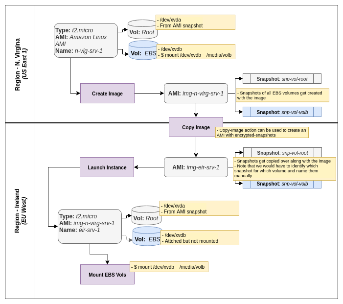

AWS Services Overview
=====================

### AWS Global Infrastructure
Main concepts :  
* Region - A geographical area such as North America, EMEA, APAC etc. Each region has 2 or more Avialability Zones (AZs).
* Availability Zones - An AZ is simply one or more Data Centers. We can assign our resources to an AZ. The AZs within a region are connected via low-latency network.
* Edge Locations - These are distributed services meant to cache data (CDN), nearer to the consumer as they are accessed.

As of 2017 there are around 16 regions and roughly 44 AZs and many more Edge Locations (circa 90). These numbers are constantly growing.

### Core Services :
### Compute
This set of services are the main work horse of cloud computing providing the compute workload services such as VMs, Containers, and Serverless.  
Taking each one by one we have:
1) EC2 (Elastic Compute Cloud) - These are VMs in the cloud. This is perhaps the oldest service.
2) EC2 Container Service - Containers such as Docker as a service.
3) EBS (Elastic Beanstalk) - PaaS for applications.
4) Lambda - Serverless service.
5) Lightsail - Watered down version of EC2, with just a server and RDP or SSH.
6) Batch - Batch computing in the cloud.

### Storage
These services provide data storage in various ways.
Going over the list we have:
1) S3 (Simple Storage Service) - Object based storage into logical compartments called 'buckets'.
2) EFS (Elastic File Structure) - Network file storage in the cloud (think NFS).
3) Glacier - Archival data storage, cheap storage.
4) Snowball - Phyiscal disks transported to AWS DC for large volumes rather than sending across network.
5) Storage Gateway - Virtual appliances for replication back to EC2.

### Databases
Database services in the cloud, and we have the following:
1) RDS (Relational DB Services) - MySQL, MS SQL, Aurora etc, PostgressSQL.
2) DynamoDB - Non-relational (No-SQL) database (like MongoDB).
3) Elastic Cache - Caching commonly consumed accessed data.
4) Red Shift - Data warehouse for analytical data.

### Migration
1) AWS migration Hub - Track applications as we migrate them to AWS.
2) Application Discovery Service - Tracking applications and their dependencies in our portfolio.
3) DB Migration Services - A service to migrate DB from on-prem to AWS.
4) Server Migration Services - A service to track ana manage our servers as we migrate them from on-prem to AWS.
5) Snowball - Physical storage to transport large volume of data to AWS DC. It is also calssified as a storage service.

### Networking & Content Delivery
1) VPC (Virtual Private Cloud) - Virtual network around our resources. You normally configure the network CIDR, ACLs, Route tables etc.*VPC is a fundamental part of any cloud infrastructure that it is essential to master this service*. 
2) CloudFront - CDN service that can cache media assets closer to the consumer.
3) Route53 - AWS DNS service.
4) API Gateway - Managing and exposing our APIs.
5) Direct Connect - A dedicated line from our on-prem/or corporate HQ to AWS (our VPC)

### Developer Tools
1) CodeStar - Collaboration on development project.
2) CodeCommit - AWS hosted source control, essentially a private git repository.
3) CodeBuild - Build service.
4) CodeDeploy - Push deployment to EC2 or Lambda.
5) CodePipeline - CI/CD pipeline to wire up the rest of the dev-tools services.
6) X-Ray - Debug and analyze serverless apps. Request tracing.
7) Cloud9 - IDE on the cloud via the brwoser.

### Management Tools
These are what we use to monitor and manage our cloud services
1) CloudWatch - Tracks metrics and performance related events. Part of the sys-ops tool kit.
2) CloudFormation - Infrastructure as Code serive for AWS, generally via script templates.
3) CloudTrail - Logs changes to your AWS instances. By default it is turned on and stores data only for one week. Very helpful for investigation and analysis.
4) Config - Keeps a record of your AWS configuration as snapshots.
5) OpsWork - Uses Chef & Puppet to configure the environment.
6) Service Catalog - Catalog of approved services, used mainly for compliance and governance.
7) Systems Manager - Used for managing EC2 instance, patching etc.
8) Trusted Advisor - Advise around various services, like security, utlization etc.
9) Managed Services - AWS managed services can provide managed services to manage your subscriptions.

### Media Services
These are brand new as of 2017
1) Elastic Transcode - 
2) MediaConvert - File based video transcoder.
3) MediaLive - File based video feed for broadcast.
4) MediaPackage -
5) MediaStore - Service optimized to store media.
6) MediaTailor - 

### Machine Learning
1) SageMaker - Deep learning service. More neural-network based.
2) Comprehend - Sentiment analysis.
3) DeepLens - AI aware camera, that is self contained and does not need to connect out to service.
4) Lex - NLP service used for chat and Alexa.
5) Machine Learning - More basic ML algorithms. Used by Amazon for its recommendations engine.
6) Polly - Text to speech convertor. We shall use this to convert our notes to MP3 files, and stream them.
7) Rekognition - Image recognition from images and videos!
8) Amazon Translate - Amazon's version of Google Translate.
9) Transcribe - Speech recognition and turn that into text. A good combination with Polly & Translate.

### Analytics
1) Athena - Run SQL queris against data in S3 buckets (like spreadsheet), it is serverless.
2) EMR (Elastic Map Reduce) - Big-Data solution as a service.
3) CloudSearch - 
4) EalsticSearch Service - Search services.
5) Kinesis - Stream processing service.
6) Kinesis Video Stream - More a media service. Ingest media streaming service.
7) QuickSight - AWS BI tool.
8) Data Pipeline - 
9) AWS Glue - ETL service.

### Security, Identity & Compliance
1) IAM (Identity Access Management) - Identity provider, management & authentication.
2) Cognito - Device authentication (temperory), after primary auth over IAM.
3) GuardDuty - Monitors for malicious activity on AWS account
4) Inspector - Agent on EC2 instance, to inspect for security vulnerabilities.
5) Macie - Scans S3 bucktes for PII.
6) Certificate Manager -  Manage SSL certificates for AWS instances. Can be CA.
7) CloudHSM - Hardware Security Module - dedicated h/w to store encrypted keys.
8) Directory Services - Integrating MS Active Directory services with AWS.
9) WAF (Web Application Firewall) - Like Layer7 FW - application level vulnerability protection - XSS, SQL-Injection etc.
10) Shield - It stops DDOS attacks. By default for many services like CLoudFront, LB etc.
11) Artifact - Download reference documentation on governance.

### Mobile Services
1) Mobile Hub - Management console for configuring mobile apps to mobile backend.
2) Pinpoint - Tragetted push notifications.
3) AppSync - Auto update of data between mobile and online.
4) DeviceFarm - Testing mobile apps on test devices.
5) Mobile Analytics - 

### AR & VR
1) Sumerian - AR, VR & 3D application design - still in preview.

### Application Integrations
1) Step Functions - Integrate Lambda functions
2) Amazon MQ - Similar to RabbitMQ, cloud MQ services.
3) SNS (Simple Notification Service) - Notification service.
4) SQS (Simple Queue Service) - Resilient queue service for decoupling.
5) SWF (Simple Workflow Service) - Workflow managing and orchestration service.

### Customer Engagement
1) Connect - Contact center as a service!
2) SES (Simple Email Service) - Scalable email sending sevice.

### Business Productivity
1) Alex for Business - Alexa used for IT support like use cases.
2) Chime - Video conferencing service.
3) Work Docs - Secure document storage, like Dropbox.
4) WorkMail - Amazon flavour of O365, use work email for AWS.

### Desktop & App Streaming
1) Workspaces - VDI service within AWS and streaming down to our device.
2) AppStream 2.0 -  Application running on AWS instance then streamed down to device (similar to Citrix).

### IoT
1) ioT - Suite of services for IoT
2) iOt Device Mangement - 
3) Amazon Free RTOS - Free OS for micro controllers
4) Greengrass -

### Game Development
1) GameLift - Game development for AWS cloud.

## Services for SA Associate exam ##
The services that come in the scope of the AWS Solutions Architect - Associte exam are -  
  
Again not all services in all these are equally important. The SA associate exam is quite broad in scope.

## IAM (Identity Acess Management)
==================================================

### IAM 101
Setting up users and managing their access to the AWS services.  
AWS IAM provides the following capabilities -
 - Centralised control of our AWS account
 - Shared access to our AWS account
 - Granular permissions
 - Identity federation (AD, FB, LinkedIn etc.)
 - Multifactor authentication (MFA)
 - Temperory access for users/devices & services
 - Setup password rotation policies
 - Integrates with many other AWS services
 - Supports PCI DSS complaince

#### Terms & Concepts
 - User - An end user of the service
 - Group - A collection of users under one set of permissions
 - Role - An identity with a set of permission policies that determine what actions it can perform on what resource
    - We can use roles to delegate access to users, applications or services to our AWS resources
 - Policies - A document that defines one or more permissions
    - We can attach a policy document to users, groups or roles
    - A policy can be shared by multiple identities (users or roles or groups)  
    - Key-value apir stored as JSON
    An attempt to describe the concepts and relationships visualy -

#### IAM Lab
Once we login to the AWS console, we can find IAM service under the category __Security, Identity & Compliance__.  
__Note__ that unlike most other services, IAM is not constrained to one region. It has a _Global_ scope.  
__Root Access__ - Our Id (email) with which we created the account. It has root level permissions within our account.

Security settings for Root account
- ***MFA Configuration***  
Virtual MFA Application - Use Google Authenticator
- ***Add Other Users***  
Create user, set password, add permissions/groups/policies.
 - Create a sys admin user
   - add to 'SystemAdministrator' group
   - day to day administration
- Create a sys developer user
   - add to 'SystemAdministrator' group (for now)
   - development work
- ***Create a Role***
Create a Role for EC2 service to access S3 service.
- ***Setup Billing Alarms***
   - Setup a budget (monthly, quarterly, anually)
   - Setup an alarm when reaching a threshold of the budget
   - Can be set for Cost, Usage, or Reservation

## AWS Object Storage & CDN
==================================================
### S3 101
S3 (Simple Storage Service) is one of the oldest service offerings by AWS. It essentially provides - _durable_, _secure_, _highly scalable_ object storage via simple web services interface. 
- S3 is _object storage_ - which means it stores the data logically wrapped with its metadata, and have its unique ID (_this is called an object_).   
It has a flat storage model without a hierarchical path like traditional file storage. This architecture makes it far easier to scale out and, also be more performant for large volumes. _Traditional block storage would have to be scaled up_.  
Behind the scene objects are replicated across different storage nodes, to ensure durability and availability.  
- We use S3 for storing documents, media, files etc. Whereas for system data such as OS, databases or applicatios we would use block storage.
- S3 has virtually unlimited storage.
- A single file can be upto 5TB!
- We pay by GB.
- S3 gives logical containers called "_bucket_" to store objects. Each bucket has a globally unique name with a unique URL to it (for e.g. https://s3-eu-west-1.amazonaws.com/acmebucket).
- S3 interaction is via HTTP request/response and a successful operation should result in an HTTP 200 status.
- ***Data Consistency model***  
S3 achieves HA (High Availability) by replicating data across multiple nodes, even data centers. Theis means that there has to be some agreed model of data consistency between write and read. The S3 model of data consistency is -
   - **Create Operation (new object)** - When we put a new object into an S3 bucket _(PUTS of new objects)_ we can expect a  _Read-after-Write_ consistency. What this means is that if we do a _read_ immediately after _putting_ a new object (has returned with a 200 status) we can be guaranteed to get the new object. _The replication across nodes for PUTS of new object is apprently synchronous. Therefore whichever node the read pulls from would have the object._ The sequence diagrams below depict the _read-after-write_ scenarios for new object -

   

     

   - There is one caveat however, if we attempt a _read_ first (of an object that does not exist yet), then do a _write_ of the new object, and immediately follow with a _read_ of the same then there is no gauarantee to get that new object.  
      This scenario is depicted in the sequence diagram below -
   

   - **Update & Delete Operation (existing object)** - When we update (PUTS) or delete (DELETE) an existing object we should expect _Eventual Consistency_. This means that if we do a read immediately after an update/delete we may get the previous state of the object, however eventually all nodes will have the same value and we will be able to get that latest value after some time.   
   It is obvious that until the update/delete is propagated to all nodes, a read may not result in the latest updated data. We have to be mindful of this when we deisgn with S3.

- ***Key-Value Store***  
Amazon S3 has a _key-value_ store data model for storing objects. An object is a composite of the following -
   - Key - _This is the name of the object, the key with which it is identified_
   - Value - _This is the actual data - sequence of bytes_
   - Version ID - _Used for versioning the object_
   - Metadata - _Tag additional information about your data_
   - Subresources :
      - Access Control List (ACL) - _Used for controlling accessing_
      - Torrent - _Used if we want to torrent our data_

   

- ***Quality Attributes***
   - Availibility 
      - S3 is _designed_ for **99.99%** availability
      - Amazon guarantees **99.9%** availability
   - Durability
      - Amazon guarantees **99.999999999% (11 X 9s)** durability of information stored in S3!
- ***Features***
   - **Tiered Storage**
   - **Lifecycle Managment** - Configure to manage the data over time, e.g. _Archive_ after period to Aamazon Glacier.
   - **Versioning**
   - **Encryption**
   - **Access via ACL & Bucket Policies** - Bucket Policies are at _bucket_ level and ACL at _object_ level.

- ***S3 - Storage Tiers/Classes***
   - **S3 Standard** - 99.99% Availability & 11x9s Durability. Most commonly used!
   - **S3 IA** - Infrequently accessed data, but still requires _quick access_ when needed. Lower fee than S3-Standard but charges retrieval fee.
   - **S3 One Zone IA** - Infrequently accessed and stored only in one AZ, hence less durability. It is cheaper.
   - **Glacier** - Used only for archival data, and is the cheapest option. Glacier has 3 flavours -
      - Expedited - a few minutes to restore
      - Standard - 3 to 5 hours for restore
      - Bulk - 5 to 12 hours for restore

- ***S3 Pricing***
With S3 we can get charged for -
   - Storage
   - Requests
   - Storage Management Pricing - tags/metadata
   - Data Transfer Pricing
   - Transfer Acceleration - faster download/upload using _CloudFront_ (AWS CDN)  

_Note: Try to stick to region N.Virginia as that is where AWS first rolls out its new features.This way we can ensure we are always on the latest stack. Though some services are 'global' (region agnostic) in scope such as IAM._

### S3 Lab
- ***Create S3 Bucket***  
   - Creating an S3 bucket is quite straight forward from the console UI. The significant thing here is that the bucket-name should be unique (as S3 objects have universal namespace). _Generally people use their organization domain name as a prefix._  
   - **Default Access**
   - AWS takes a restrictive approach to ensure security. All newly created S3 buckets are 'private' (not for public access). All objects added to the bucket are also 'private' by default.  
   It has to be explicitly made public by going to _Permissions_ -> _Public Access Settings_ -> _Edit_.  
   After making the bucket public, the object has to be made public similarly for access.
- ***Bucket Properties***  
   An Amazon S3 bucket has various properties to manage it:
   - **Versioning** - Keep multiple versions of the same object in the bucket and mange those versions.
   - **Default Encryption** - Automatically encrypt objects when they are stored in S3.
   - **Object Lock** - Prevent object from being deleted.
   - **Tags** - Tag with metadata, use for associating with cost centers etc.
   - **Transfer Acceleration** - Enable quicker network access using edge CDN.
   - **Events** - Receive notifications when specific events occur on your bucket.
   - **Server Access Logging** - Setup access logs to view details of access requests.
   - **Object Level Logging** - Record object level API activity using _CouldTrail_ data events. This incurs extra cost.
   - **Static Web Hosting** - Host a static web site that does not require any server side web technologies. I.e. just serve files.
   - **Requestor Pay** - Option for the requestor to pay base don access, instead of the bucket owner.  
- ***Bucket Permissions***  
   Manage permissions on the bucket:
   - **Public Access**
   - **ACL**
   - **Object Policies**
   - **CORS (Cross Origin Resource Sharing)**  
- ***Bucket Management***
   Features to manage the lifetime and usage of a bucket:
   - **Lifecycle**
   - **Replication**
   - **Storage Analyitics**
   - **Metrics**
   - **Object Inventory**  

- ***Version Control***  
We can enable _Versioning_ to track and access different versions of the same object.
   - Once we enable versioning for a bucket it cannot be _disabled_, it can only be _suspended_. 
   - Once enabled the bucket keeps track of each version of the object that we upload.
   - Note that object permission is applied at the version level, which means if an object is public and we upload a new version, then the latter will not automatically be public. We have to explicitly make the new version public.
   - The URI for accessing a specific version of the object uses a query parameter _versionId_ -  
   e.g.-> https://s3.amazonaws.com/my-unique-bucket/test-1.txt?versionId=V67j9XSjHYM2Y2NBNAxqLgAOU7PN6akt  
   - Deleting an object does not actually delete it, it just adds an extra version entry for a _delete marker_. We can still see all the versions if we click _Version_ -> _Show_
   - We can restore the object by undoing this marker (simply delete that marker entry)!
   - In order to compeletly remove an object we would have to delete all versions of the object.
   - Versioning can be integrated with _Lifecycle Rules_.
   - Versioning MFA Delete capability can be used to provide additional layer of security.  
- ***Cross-Region Replication (CRR)***  
We can setup _Replication_ to synch up buckets in different regions.
   - CRR can only be setup between buckets in different regions.
   - For replication the _Versioning_ has to be enabled on the target bucket.
   - We can replicate the entire contents of the bucket or selected items based on _Tags_ or _Prefixes_.
   - The target bucket for replication can belong to a different accout, and even the ownership of the target bucket can be delegated.
   - Replication requires an IAM role to be associated with it. This enabes access control and monitoring.
   - While setting up CRR, there is a gotcha that can catch you unawares. At the step to setup the IAM role for replication we can get an error - _"Inavlid role specified in replication configuration!"_. This happens because the user yu are logged in as is an IAM user (typically non-root users are not given IAM permissions), i.e. not the _root user_. In order for replication to create the role it requires the current user to have IAM permissions.
   - Only new and modified objects after turning on CRR will get replicated over, already existing objects will not (_this is similar to Versioining, versions are created only once we turn it on, for existing objects the versions will be null_). Existing objects have to be copied over via the CLI.
   - For CLI, install the AWS CLI and then configure it with the _Access Key Id_ and _Secret Access Key_ of the desired user account.
   ```
   $ aws configure
   > ...
   ```
   After configuring we can test it by typing in a few commands to check the version, and to list the S3 buckets associated with the configured user
   ```
   $ aws --version
   > aws-cli/1.16.77 Python/3.6.0 Windows/7 botocore/1.12.67

   $ aws s3 ls
   > ...
   ```
   - To copy the contents over from one bucket the other we use the _copy_ command from the CLI
   ```
   $ aws s3 cp --recursive s3://my-source-bucket s3://my-destination-bucket
   > ...
   ```
   Note how the source and destination buckets are specified - _'s3://\<bucket-name\>'_
   - Now we can go to the console and check and, indeed our objects are copied over from the source bucket to the destination. _Note that if we look at the 'Version Id' of an object, it is a different value in both buckets (this is only for manually copied over objects as we will see)!_
   - If we now change one of the files within the _source bucket_ and upload it, the change should get replicated across almost immediately. _Note how in this case the latest version of the modified file is automatically copied over and it has the exact same 'Version Id' value in both source and destination buckets!_
   ```
   # we can upload from the command line
   $ aws s3 cp <local-path> s3://<bucket-name>
   > ...
   ```
   - Finally _deleting_ objects (whether it is just placing a _delete marker_ or deleting a spcific _version_), does not get replicated. It is by design, a safety feature to prevent removal of objects from the source bucket, also removing them from the target (which is considered a _backup_).
   - As of end 2018 we cannot replicate to multiple S3 buckets or be daisy chained, though this might change in future.  
- ***Lifecycle Managment***  
   How to manage data over time. For example move data after some duration to the cheaper S3-IA tier, then later archive it into Glacier or even permenantly delete it. AWS provides a _Lifecycle Management_ service to configure this.
    - Configure rules to transition objects to tiered storage.
    - Expire objecst based on rules.
    - _Lifecycle_ rules can have filters based on prefixes or tags for selective objects.
    - Transition rules can be applied to _current version_ and/or _previous versions_ of the object.
    - Can be applied with or without _Versioning_ turned on.
    - Minimum transition duration is 30 days.
    - An example of a typical _Lifecycle_ rule would be -  
      
- ***CloudFront Overview***  
   CloudFront is Amazon's own CDN (Content Delivery Netwrok). A CDN is a system of distributed webservers spread geographically and can host and deliver web content based on the location of the user.  
   Some key terminology -
   - **Origin** - The source/origin of the files that are dsitributed via the CDN. In the case of AWS the origins can be S3 buckets, EC2 instances, Elastic Load Balancers, or Route 53 (the former 2 are most common)._Note that an origin does not have to be an AWS service, it can be ay other web resource_
   - **Edge Location** - The location where the content will be _cached_. This is different from _Region/AZ_, and for AWS it is spread across the globe.
       - An edge location is not just read-only, we can write to them (like put an object in). This will then behind the scene be pushed up to the origin.
       - Objects are chaced at the edge location for a duration call TTL (Time To Live).
       - Objects will automatically expire after the TTL. We can expunge/clear the cached object but we can get chraged for that!
   - **Distribution** - The logical name given to a collection of _edge locations_.
   - **Web Distribution** - Typically used for web pages.
   - **RTMP** - RTMP stands for _Real Time Media Protocol_, used for media streaming on the internet. Though RTMP is being slowly replaced by HLS (HTTP Live Streaming) protocol.  

   - ***CloudFront Lab***  
   To solidify the concepts, let us get our hands dirty and setup a CloudFront _distribution_ and test it.   
   <u>Origin</u>  
   We shall use an S3 bucket as the _origin_. Let us create one ina region far from us. In my case I am making one in Sydney. Then I give it access permissiona and upload a big mage file. Now I use a script (Python 3) to access this and measure the time it takes to download - 
   ```python
   # skipping the initial imports and proxy code

   object_url = 'https://s3-ap-southeast-2.amazonaws.com/my-sydney-bucket/my-large-image.jpg'
    
   def access_object(url):
      rsp = requests.request("GET", url, proxies=proxies)
      return rsp

   try:
      ts = time.perf_counter_ns()
      rsp = access_object(object_url)
      tt = time.perf_counter_ns() - ts
      print('status = {0} ; size = {1}'.format(rsp.status_code, len(rsp.content)))
      print('>> time taken = {0:.2f} seconds'.format(tt/1000000000))

   except Exception as ex:
      print (ex) 
   ```
   This will give us the output - 
   ```bash
      status = 200 ; size = 294718
      >> time taken = 5.81 seconds
   ```
   It takes around 5.8 seconds to download around 29KB from my S3 bucket in Sydney!  
      <u>Distribution</u>  
   We can now setup a CDN distrtibution to cache this S3 bucket and try to acess the image through the CDN. We can do this from the console and going to _Services_ -> _Networking & Content Delivery_ -> _CloudFront_
   - For this lab, we shall create a _Web Distribution_  
   <u>There are a number of options we have to specfy in order to configure the _Distribution_</u> - 
   - **Origin domain** - We select our S3 bucket -> my-sydney-bucket
      - For non AWS services we provide the web address of the resource

   - **Origin path** - If there is a directory within our bucket that we want to get the content from then we specify that with a '/'. In this case we leave it blank

   - **Origin ID** - A unique (within the distribution) name for the origin. Note that a distribution can have multiple origins 
   - **Restrict bucket access** - Setting this will prevent direct access to the _origin_, it can only be accessed via the CDN then. This is especailly useful when we want to restrict to private access via _signed URL_ or _signed cookie_. If we select _Yes_ then we have to set a few additional properties -  
      - **Origin access identity** - This creates a new user-identity which will be used to access the _origin_ (the S3 bucket in our case) from the CDN
      - **Grant read permissions on bucket** -  Give the _origin access identity_ permission to access the _origin_ (S3 bucket). Remember to click _Yes update bucket policy_ else this would have to set manually  

   _Since we are blocking direct access to the S3 bucket, there has to be some exception role/identity that can be used by the CDN to access the bucket_
   - **Viewer protocol policy** - Specify the HTTP & HTTPS behaviour. We shall use _Redirect HTTP to HTTPS_  

   - **Time To Live (TTL)** - Specify the _minimum_, _default_ & _maximum_ TTL values in seconds. We shall leave the default values for now viz. - _default TTL = 24 hrs_ & _maximum TTL = 1 year_. In a real scenario this is an important design consideration as manually invalidating the cache can incur a cost

   - **Restrict viewer access** - When we want to conditionally restrict access to our CDN resource we do that by enabling this option and then generating a _presigned URL_ or _signed cookie_ and accessing the resource using that. For example when we want to restrict access to paid customers. We will not restrict any access 

   - **Lambda Function Association** - Link events on the _distribution_ to a _Lambda Function_. We shall leave this blank  

   - **SSL certificates** - We shall use the default _cloudfront certificate_, but we can opt for a custom SSL certificate if required. Then we can configure and manage that through the _AWS certificate manager_
   - **Supported HTTP versions** - Now _CloudFront_ has support for HTTP/2 (as well as HTTP/1.1 and older)
   - **IPv6** - Recently added support for IPv6. It is enabled by default

   - **Applying Restrictions** - We can use this to apply restrictions based on geographical locations. Either _whitelist_ or _blacklist_ the countries that can access the distribution

   _Note that there are many more options and I have ignored them in this list as it is too extensive to cover each in depth. In any case we have left them all as default values!_  

   _Also note that once we create or apply changes, the actual provisioning for the distribution can take a while (15 to 20 minutes at least)_  

   Once created we would have an _ID_ and _Domain Name_ for the _distribution_ that we can use to access the resources. For example we could get a _domain name_ such as - 
   d651a7rd02db4c.cloudfront.net  
   Then we can execute the above Python script with the modified object URL via the CloudFront domain name -
   ```python
      # use the cloudfront domain name for the resource url
      object_url = 'https://d651a7rd02db4c.cloudfront.net/my-large-image.jpg
   ```
   Now when we execute the script, we should get the following results -
    - The first run we would get something like - 
   ```bash
      status = 200 ; size = 294718
      >> time taken = 5.52 seconds
   ```
   The first access tme is no different as it is still pulling the resource down to the nearest edge location.
    - The subsequent runs we would get something like - 
   ```bash
      status = 200 ; size = 294718
      >> time taken = 1.48 seconds
   ```
   - **Reports & Analytics** - This section provides options to view and analyze the usage of our CloudFront _distributions_

   Finally we have to remember to _disable_ and _delete_ our distribution, as we can get charged for this.  
   
- ***S3 Security & Encryption***  
   - **Securiy**  
      - **Access**  
      All newly created buckets are private. If we wish to access the objects within a bucket we have to explicitly go and make them _public_ of grant access to them.  
      There are two ways to control access to S3 buckets -
         - *Bucket Policies*  
            These are buckt-wide in scope and apply to all items within the bucket.
         - *Access Control Lists (ACLs)*  
            These are more finegrained and can control access to individual objects within a bucket.
      - **Access Log**  
      S3 buckets can be configured to log all access requests. These can be logged in the same bucket, a different bucket or even the bucket of a different account!
   - **Encryption**
   There two aspects to encrypting data, namely -
      - **Encryption in Transit**  
         This is achieved using SSL/TLS  
      - **Encryption at Rest**  
         There are 2 appraoches to encrypting data at rest, namely -  
         - **Server Side Encryption (SSE)**  
         S3 provides 3 methods for SSE -
            - *S3 Managed Keys -> SSE-S3*  
            Each object is encrypted with a unique key and that key is then further encrypted with a master key. AWS mananges all the encryption keys for us behind the scene. It uses AES 256 standard.
            - *AWS Key Managment Service -> SSE-KMS*  
            Added feature of control over the envelope key so gives an added layer of protection. It also gives an audit trail of decryption. This coes with some extra charge. 
            - *SSE with Customer Provided Keys - SSE-C*  
            In this AWS only manages the encryption/decryption, but we manage the keys.
         - **Client Side Encryption**  
         This where we encrypt the data on the client and upload it to the bucket.  

- ***AWS Storage Gateway***  
AWS Storage Gateway is a storage service that enables on-premises applications to seamlessly use AWS cloud storage.  
   - The applications connect to the cloud storage service via a gateway appliance (which can be virtual or physical device)
   - They can connect to the storage using standard storage protocols such as NFS (_Network File Storage_), SMB (_Server Message Block_), iSCSI (_SCSI over IP_)
   - The gateway connects to AWS storage services such as _S3_, _EBS_ or _Glacier_ to store _Files_, _Volumes_ or _Tapes_  
   - We can use this for things such as -  
      - Storage tiering
      - Cloud data processing
      - Backup & recovery
      - Archiving
   - The implementation provides -
      - Highly optimized data-transfer
      - Bandwidth management
      - Automated network resilience
      - Local cache for recently accessed data  

Once installed and activated with our AWS account we can configure it to use the Gateway service as required.  
The diagram below depicts this setup at a basic level -  
  

There are __4 types__ of Storage Gateways -   
- **File Gateways (NFS)**  
This allows us to store _files_ directly as objcets in S3. The buckets are accessed as NFS mount point. Once written to S3 the oject can be treated and managed just as we would any S3 object.  

- **Volume Gateways (iSCSI)**  
This provides a way to use block based storage in the cloud from on-premises applications. The gateway allows us to access the cloud storage as iSCSI volumes. Think of these as _virtual hard drives_ on the cloud!  
Data written to these volumes are asynchrnously copied as point in time EBS snapshots to the cloud. These snapshots are incremental, they contain only the changed blocks. They are also compressed to minimize storage charges.  
All _Volume Gateway_ data written to the cloud is stored in Amazon S3 as EBS snapshots, they are encrypted at rest using _SSE_. However these snapshots cannot be accessed via teh S3 API or management console!   
It is importnat to keep in mind that, _Volume Gateway_ services have on-premises storage hardware associated with them.  
_Volume Gateways_ are of two types -
   - **Stored Volumes**  
      All data written to the _Stored Volume_ is written to the on-premises storage hardware associated with that volume and then, asynchronously copied over to Amazon S3 as EBS snapshosts. They can range from 1GiB to 16TiB, and a gateway can support upto 32 volumes (for a total of 512 TiB).  With _Stored Volumes_ we keep a complete copy of the data on-premises.  
   - **Cached Volumes**  
   In the case of _Cached Volume_ the primary storage is our cloud storage. All data is written to Amazon S3 (via a staging area - upload buffer). Only recently accessed data is cached locally for low-latency access. Compared to _Stored Voulme_ this approach minimizes the need for us to scale our on-premises storage capacity, while still maintaining local cache for recently accessed data. _Cached Volume_ can range from 1GiB to 32TiB.
- **Tape Gateways (VTL)**  
This option provides a cost-effective way to archive data to the cloud. We can use existing tape-based backup infrastructure to bacukup data to _virtual tape cartridges_ that we can create on the _Tape Gateway_. Each gateway is preconfigured with media changer and tape drives. The backup applications can access these as iSCSI devices. A high level diagram dpeicting this setup is given below -  
  

- ***AWS Snowball***  
Sometimes there is a need to move large volumes of data (TiB, PiB) into AWS and trying to do that over the internet can be very time consuming and even expensive. To resolve this Amazon used to provide a service called _Import/Export Disk_. We could send in an external storage disk with our data and AWS could directly transfer the data off the disk (bypassing the internet). This is a phyiscal movement of data via disks. But this poses many challenges with customers sending in different types of disks with different connections, ensuring security etc. In order to manage this, Amazon standrdized this process with a service called _Snowball_. This uses a Amazon provided phyiscal storage appliance to store and tranfer the data.  
There are 3 types of _Snowball_ services:
   - **Snowball** - These are Petabyte-scale data tranfer solutions using phyiscal appliances into or out of AWS. This addresses challenges of tranfer-time, bandwidth-costs, and security. These are highly secure, tamper-resistant, 256-bit encrypted devices with full traceability. It is also very cost effective and can be _one fifth_ the cost of tranferring over the internet. Once data is transfered AWS errases the data from the appliance. As of early 2019 they come with 80TB storage capacity.
   - **Snowball Edge** - These are essentially _Snowball_ with 100TB of storage capacity with _onboard compute_ capability! _Snowball Edge_ comes in two flavours (as of eraly 2019) -
      - *Snowball Edge Storage Optimized* - They come in 100TB with 24vCPU best for large scale data collection and migration.
      - *Snowball Edge Compute Optimized* - They provide 52vCPu and optional GPU for high performance machine learning or data analysis use cases.
   These applainces can be clustered to form larger temperory installations. The come with specific EC2 instances and _Lambda Function_. They cacn collect, pre-process and return data. Good use-cases include IoT stream processing, or pre-processing data for analysis and migration from remote locations, which would eventually transfered to AWS.
   - **Snowmobile** - _Snowmobile_ is used for Exabyte-scale data transfer. They are essentially a mini DC on wheels - A 45 foot long ruggedized shipping container pulled by a semi-trailer truck! The service is provided accompanied by specialists who help assess, connect, transfer and scecure the data. Each _Snowmobile_ has a capacity of do 100PB.  
   It comes with 256-bit encryption, full trace of chain-of-custody. In addition it has 24/7 video surveillance, security personnel and GPS tracking.  
   It is a very cost effective way to transfer huge volumes of data securly and in less time. It can even do a complete data center migration. 
A _Snowball_ can import to or export from _S3_. If we want to use _Glacier_ we would have to do it via _S3_.

- ***S3 Transfer Acceleration***  
This is a new service that allows us to leverage _CloudFront_ to accelerate transfer of data to and from S3.  
When we setup a bucket we can enable _Transfer Accelerate_ option on it and this will give us a _Cloudfront_ endpoint for our S3 bucket, something like :  <u>my-bucket-name.s3-accelerate.amazonaws.com</u>  
Now we can use this endpoint to interact with the bucket and, AWS will behind the scene synch up the data to the S3 bucket.

- ***Static Website using S3***
Amazon S3 provides an easy way to host static websites. Essentially a website that serves up files (HTML pages, that can have CSS and JS if needed). It cannot have any server side code or runtime such as ASP, ASP.net, Servelet or Spring etc.  
In order to do this we simply use the _Static Web Hosting_ option in the _properties_ tab of the S3 bucket.    
This should give us an endpoint such as: <u>http://myBucketName.s3-website-us-east1.amazonaws.com</u>  
Specify the _index document_ (index.html or defualt.html), and the _error document_ (error.html).  
In order for us to access the files within the bucket we would have to make it _public access_ and the contents within it public by configuring the _bucket policy_. The latter can be configured using JSON as shown:
```JSON
{
	"Version": "2012-10-17",
	"Statement": [
		{
			"Sid": "PublicReadGetObject",
			"Effect": "Allow",
			"Principal": "*",
			"Action": [
				"s3:GetObject"
			],
			"Resource": [
				"arn:aws:s3:::myBucketName/*"
			]
		}
	]
}
```
Now we can upload our souce files (HTML, CSS, JS) and then we are good to go. If we access the resource using the url <u>http://myBucketName.s3-website-us-east1.amazonaws.com</u> it should got the site and the default page (index.html in our case) should be served to the browser.  
Note : Even though we call it static website, the pages can be interactive with client-side code.  
The advantage of using S3 to host content websites is that it can scale automatically and many organizations use this approach if they feel that there might be huge and variable demand.

## EC2 (Elastic Compute Cloud)
==================================================

### EC2 101

#### What is EC2
It is an AWS service that provides resizable compute capacity on demand in the cloud. We can obtain and provision server instances in minutes to scale up or down depending on demand.  
This not only improves the time to scale up or down, but also changes the economics of server infrastructure, as now we can pay for what we use (or provision) rather than heavy upfront capital expenditure. Also typically in the old world we would always overprovision with enough spare capacity that we could grow into. This would leave us with unused capacity that we had paid for, and eventually fill up till we have to buy again! 

#### EC2 Billing Options
This brings us to the different pricing models that AWS provides for EC2. Each option is designed with different use cases in mind, and one of the importnat skills for architect is to be able to identify the optimal option for a given scenario.  
The various billing options are:  
   - **On-Demand** - This option allows us to pay a fixed rate by the hour (_in the case of Windows servers_) or seconds (_for Linux servers_), without any commitment.
      - Where we need the flexibility without long term commitment.
      - For _workloads_ that are spiky, or unpredictable and cannot be interrupted.
      - Applications that are being developed on AWS for the first time.
      - Keywords - _Variable_ or _Unpredictable_ Workloads, _No Commitments_.

   - **Reserved** - We can sign up for a contract term of 1 year or 3 years. Whilst this ties us in for the period, we get a significant discount on the hourly rate.
      - This is a good fit for applications that have a known predictable demand.
      - Applications for which we need fixed reserved capacity.
      - Up-front payments and longer terms give us greater discounts
         - For standrad RIs a full up-front payment for 3 year term can give 75% off the on-demand price!
         - For convertible RIs this can be upto 54% off. Convertible RIs give us some flexibility to change some configurations like going from a CPU optimized instance to a Memory optimized instance. The conversion has to result in instances of >= value as the existing.

   - **Spot** - Spot instances allows us to _bid_ a price for some capacity and use it when it is available. This can then be offloaded as well. It is similar to bidding and selling stocks, and works well in situations which affords flexibility in start and end times.  
      Spot instances are charged by the hour, and they can get terminated if the price goes above your bid-price. If this happens then AWS will not charge for the partial hour. However if you terminate the instance in between and hour you can get charged for the whole hour.
      - Applications that have a huge amount of compute needed (like pharmaceuticals, genomics etc.) but have flexibility in the time they do it.
      - Requires very low compute prices.

   - **Dedicated Hosts** - These are single-tenant hardware deicated to the customer, with configuration they can control. This might be needed if we have softwares that have server-bound licenses.
      - Regulatory requirements might enforce dedicated hardware for a tenant.
      - Some software licenses are hardware bound and cannot be used in a multi-tenant installation.
      - Can be purchased as reservation for upto 70% off the on-demand price. 
      - Tenancy attributes for instances -
         - _default_ - instance runs on shared hardware
         - _dedicated_ - instance runs on _single-tenant_ hardware
         - _host_ - instance runs on dedicated hardware, with _configurations_ the customer _can control_

   - **Dedicated Instances** - We can pay by the hour for instances that run on single-tenant hardware.

   - **Scheduled** - These would be instances that are available on a specified schedule on a recurring basis for a 1 year period.

   - **Capacity Reservation** - Reserve capacity for EC2 instances for any duration in an specific AZ.

#### EC2 Instance Types
When we setup an EC2 instance, the _instance-type_ determines the hardware of the _host_ computer used. The instance types are optimized for different resource configurations such as CPU, memory, storage, IO and are grouped into instance families based on these capabilities.  
The _instance families_ are:  
> 1 - **General Purpose**  
General purpose inatnces are the common standard instance types that provide a balance of _compute_, _memory_, _storage_, _network_ resources and can be used for a variety of workloads.
   - M5, M5a, M5d - _These are based on the Intel Xeon scalable processor or the AMD EPYC processor._ 
   - A1 - _They are the first generation of ARM processor  based instances._
   - T2, T3 - _These instance types provide a baseline level of CPU with the ability to burst to higher levels when required by the workload._

> 2 - **Compute Optimized**  
> These instance types are optimized for heavy compte workloads (like data analytics) and have higher ratio of vCPUs and core with higher clock-speeds.
>
>    - C4, C5 - _The latest of the compute optimized category._

> 3 - **Memory Optimized**  
For use cases requiring large RAM (like in-memory data processing or analytics) this family of instance types are best.
   - R4, R5, R5a, R5d - _These are the baseline memory optimized instance type._
   - X1 - _Extremely high memory requirements._
   - Z1 - _They provide high compute along with high memory._

> 4 - **Storage Optimized**  
These instance types provide large local storage within the instance itself. They are best suited for workloads that require high volume/rate of sequential read-write of large data-sets on local storage. They can deliver tens of thousands of IOPS.
   - D2
   - H1
   - I3

> 5 - **Accelerated Computing**  
For workloads that require high performance computing or massive parallel processiing AWS provides instance types that have access to hardware-based compute accelerators like GPUs (Graphichs Processing Units) and FPGAs (Field Programmable Gate Arrays).
   - F1 - _FPGA-based instance type for computationally intensive algorithms._
   - P2, P3 - _GPU-based instance type._
   - G2, G3 - _GPU-based instance type._  

The table below shows a high-level overview of the instance familes with the types of instances and uses cases - 
  
_There are a few mnemonics to help remember these types_ - 
   - gMAT
   - cC
   - mR XZ
   - FPGa
   - DIsH

##### Format - Instance Types
The EC2 instance type names could look cryptic - _m5.2xlarge, t3.medium, t2.micro, r5d.4xlarge, p3dn.24xlarge_  
But there is a method to this madness, the instance type name actually conveys information about the size and certain capabilities of the instance such as - 
   - Number of vCPUs
   - Clock speeds
   - Presence of h/w acceleration - GPU, FGPA
   - Amount of RAM
   - Presence of Local-storage
   - Network connectivity & speed
The general format is -  
**\<family>\<generation>[\<sub-indicator>].\<t-shirt size>**  
> **Family** - Type prefixes such as _m, t, a, c, r, x, z, f, g, p, d, i, h_

> **Generation** - Indicates the version of the technology within the same family. Higher numbers mean more recent versions and normally more advanced

> **Sub-indicator** - Indicates the presence of some specific capabilities that differentiates its from adjacent types in the family/generation -   
   - > _d_ - They have instance-storage, which means on these instances there is locally attached storage on the host that can be accessed directly (in addition to EBS)
   - > _n_ - They are optimized for network speed supporting throughputs of 100 GBPS.

> **T-shirt size** - Indicates the number of vCPUs and RAM there is. The higher the size more RAM and processor cores. A general rule of thumb for deciphering vCPUs is - 
   - > _large_ - 2 vCPUs
   - > _xlarge_ - 2 X large = 4 vCPUs
   - > _4xlarge_ - 3 X xlarge = 12 vCPUs  

   For RAM there is no clean pattern but higher numbers have more.  

So for example _c5d.9xlarge_ : _compute optimized_ - _5th generation_ - _local storage_ - _36 vCPUs_  

#### AMI (Amazon Machine Image)
An AMI provides the configuration information required to launch an instance. It is preconfigured with the information about the root volume, OS, software packages if any. When we launch an EC2 instance the first thing we do is to select an AMI which has the configurations needed for that instance.  
Components of an AMI:
   - A template for the _Root Volume_ of the instance, which would contain   
      - Operating System
      - Additional softwares
   - Launch permissions that control which AWS accounts can use the AMI to launch instances.
   - Block device mapping, which specifies the volume to be attached to the instance when launched.  

AMIs come in different categories and falvours:
-  _Standard AMIs_ - These are AMIs provided by AWS for standard configurations and available for most of the operating systems and associated softwares.
- _AMI Market-place_ - There are many 3rd-parties that can create AMIs with configurations for their products, software packages. They are mostly applicable for licensed software.
- _Our Custom AMIs_ - We can create our own AMIs and then use those to launch EC2 instances for specific uses. To do this we can launch an instance from an existing AMI, custmize the instance and then save the configuration as a new AMI. We can also decide to make it _EBS-backed-AMI_ or _Instance-store-backed-AMI_.
   - We can decide to keep our custom AMIs private or ake it public for sharing or purchase

**De-regsitering an AMI** will prevent any new instances from being launched with that. Existing instances will not be affected.

_Amazon Linux 2_ and _Amazon Linux AMI_ are the most common AMIs. These are provided and maintained by AWS. They provide upto date Linux versions with common software packages, as well as packages to integrate with common AWS services and utilities.  

#### EC2 Data Storage
EC2 provides us with a number of data-storage options, each with its own _performance_ & _durability_ characteristics.  
Before we delve into the types of EC2 storage solutions, we should have a basic understanding of the different types of storage technologies. The table below should give a sufficient overview for our purpose:
  

The storage options available with EC2 are:
-  Elastic Block Store (Amazon EBS)
-  Amazon Instance Store
-  Elastic File System (Amazon EFS)
-  Simple Storage Service (Amazon S3)

Whenever we launch an instance from an AMI, a _root storage device_ is instantiated for it which contains all the OS information to boot the instance. This is specified in the AMI.  
We can specify additional storage volumes in the AMI using _block device mapping_.

##### Amazon Elastic Block Store (EBS)
- EBS provides _durable_ block storage for use with EC2.  
- They are highly _available_ and _reliable_ storage volumes that can be attached to any running EC2 instance within the same AZ.
- An EBS volume behaves like an external block device that we can attach to an instance. A given EBS volume can be attached only to a single instance at a time.
- An instance though can have multiple EBS volumes (depending on the Account limit).
- EBS volumes persist independently of the lifetime of EC2 instances. They can be detached from one instance and attached to another.
- EBS is best suited for database-style applications that have high random I/O, and also for throughput-intensive applications that have long continuous read-write.
- Amazon EBS encryption provides a simple encryption-at-rest solution. 
   - If we attached an _encrypted EBS volume_ to a _supported instance_ all, data-at-rest, disk I/O, and snapshots created from that volume are encrypted. Encryption happens on the associated EC2 instance and provides data-in-transit encryption from the insyance to the EBS volume. This typically uses the AWS Key Management Service (KMS), but we can choose to use Customer Master Key (CMK) if needed. 
- For backup we can create a _snapshot_ and store that _snapshot_ in S3. 
- We can also create an EBS volume from an S3 _snapshot_ and attach that to another instance.
##### Amazon EC2 Instance Store
- This is block storage that is physically attached to the host machine.
- Instance store is _not a durable_ storage, and is persisted only for the lifetime of teh instance.
   - If the instance _stops_, or _terminates_, or there is s _hard disk failure_, all data will be lost.
   - If the instance _reeboots_, however the data would be retained.
- Instance store is suitable for temperory storage use-cases such as scratch-data, buffers, caches, temperory files etc.
- Instance store volumes have to be specified when the instance is launched. Then it has to be formatted and mounted. We cant't add instance store volumes after the instance is launched.
- We can't detach an instance store volume and attach it to another instance. It is tied to the instance it was luanched with.
- If we create an AMI from an instance, the data on the associated instance-storage is not part of the image.
- Instance sotre costs are part of the instance's usage-cost.
##### Amazon Elastic File System (EFS)
- EFS povides scalable file storage for EC2 instances.
- We can use EFS as a common data source across workloads/applications running on multiple instances.
- We first create an EFS, then configure our instance to mount the EFS (_specify a mount-point_) and finally use it for storing data.
- As of 2019 Feb, EFS is not availabe for Windows inatnces.
##### Amazon Simple Storage Service (S3)
- Amazon S3 provides reliable, highly-scalable, inexpensive data stirage solition.
- S3 is an _object storage_ and stores data as _objects_ within _buckets_.
- _Buckets_ help organize the S3 namspace at the top level, and associates it with an account. Each _bucket_ has to be a globally unique name. 
- S3 _objects_ are accessed through HTTP/S.
- AWS stores S3 objects redundantly on multiple devices across multiple facilities.
- S3 allows _concurrent_ reads & writes to the _object_ by many different clients. This makes it ideal for distributed computing architectures where concurrency is primary, and eventual consistency is acceptable.
- Amazon uses S3 to stores AMIs and snapshots (backup copies) of data volumes.
- S3 also supports APIs to interact with it programatically.  

### EC2 Lab
Now we can play around with setting up an EC2 instance, launching it and then connecting to it remotely over SSH.  

**Launching and Instance**
- So we go to the _EC2 Dashborad_, then click on _Launch new instance_.
- This should give us a list of AMIs to choose from. We shall choose a _Amazon Linux 2 AMI (HVM), SSD Volume Type_ image.
- For the instance-type we shall be using a _"t2.micro"_ , which is sufficient for our purposes.
- Now we _configure instance details_:
   - Number of instances = 1
   - Network = _leave it as the default vpc_
   - Subnet = _A CIDR address block-range, that represents an AZ. A subnet cannot span across AZs_. Leave it as default.
   - Auto-assign Public IP = _Use subnet setting_
   - IAM Role = _Leave it as None_
   - Shutdown Behaviour = _Leave it as Stop_
   - Enable Termination Protection = _Let us turn it on and see how to turn it off later_
   - Monitoring = _We don't want detailed CloudWatch monitoring, so leave it unchecked_
   - Tenancy = _Default, run instance on shared hardware_
   - _There are many more options now with placement-groups, advanced-details etc. We will not be using any of these and leave those default_.
- Next we _add storage_:
   - We can see the _root_ volume details. 
   - It has the "_delete on termination_" option turned on by default, which means that if the instance is terminated then the storage attached to the root volume will be deleted.
   - There is an _Encryption_ option, but that can be applied only to additional storage. The _root_ volume cannot be encrypted (by default). _There are ways to create and provision encrypted root volume AMIs_.
   - We can have additional storage volumes if needed, but we shall leave it as it is now.
- Next we can add _Tags_:
   - We add custom attributes/tags to help collect data for reporting and cost control. In production scenarios we would use _tags_ extensively.
- Finally we _configure security groups_:
   - "_Security groups_" are just a set of _firewall rules_ that control network traffic to our instance.
   - So give a "security group name", and "description".
   - Select SSH, HTTP, and HTTPS types of traffic. Leave the "_Source_" as _"Anywhere"_ for now. We can restrict the source to specific IP address ranges if we wish to. In our case since we do not have static-IPs to use we shall just leave it as _"Anywhere"_ and make sure we delete/turn off the instance once we are done!
- At last we can _review_ & _launch_ the instance. It will now ask to create a _"public-private key-pair"_. Download and keep a copy of this _"*.pem"_ file. This will be used to securly connect to our instance (over SSH for example).
- Now the machine will be launched, and we can see it in the _instances dashboard_. If we select our machine we should be able to see its properties. We can see the _public IP_ for the instance.

**Connecting to the Instance**
- Connecting via SSH:
   - On Windows we can use _Putty_ but I prefer to use _Git Bash_.
   - To keep things clean let us move the _"*.pem"_ file to new sub-folder _"./ssh"_
   - Set permissions on the file with:
   ```bash
   $ chmod 400 my-key-pair.pem
   ```
   - This will make it readonly for the current user and not accessible to anyone else.
   - Now we can SSH to the instance using the command:
   ```bash
   $ ssh -i <path-to-pem-file> <user-name>@<host>
   ```
   - Amazon EC2 instances have some default user names we can use, depending on the AMI:
      - Amazon Linux = ec2-user
      - RHEL = root / ec2-user
      - Ubuntu = ubuntu
      - Fedora = fedora / ec2-user
      - SUSE Linux = root / ec2-user
   - For the -"host"_ we can use the _"public IP address"_ of the instance.
   - So in our case we would ssh in like:
   ```bash
   $ ssh -i ./ssh/my-key-pair.pem ec2-user@100.31.35.29
   ```
   - This should now establish an SSH connection to our EC2 instance as _"ec2-user"_ in the console.
   - From here we can interact with the machine from the CLI as if we were connected locally.
   - Once we are done playing around with it, _we can terminate the instance_.

### EC2 Security Groups
_"Security Groups"_ are essentially a _set of firewall rules_ and controls traffic to/from our EC2 instances. When an EC2 instance is launched it should at least have one _security group_. An instance can have multiple _security groups_.  
- When we setup a _security group_ we specify the following:  
   - **Type of connection** - SSH, HTTP, HTTPS etc.
   - **Protocol (trannsport)** - TCP
   - **Port range** - 22, 80, 443 etc.
   - **Source connection (IP range)**
      - _Allowed source IP address range_
      - e.g. for any - 0.0.0.0/0

- Any changes we make to the _security group_ will apply immediately.

- On key point about _security groups_ is that these rules are "stateful", which means that if a rule is applicable for an _inbound_ request it is automatically applied to _outbound_ response. If we wish to explicitly control the outbound differently from the inbound we can use _ACLs_ when setting up the _VPC_ (which we shall cover later).

- _Security groups_ have a _default-exclude explicit-include_ model. By default nothing is allowed, we have to explicitly include the traffic (type, protocols, ports, IPs) that we want. We can't use _security group_ to explicitly exclude traffic.

- When we create an EC2 instance AWS automatically assigns it to a default VPC _security group_ with source as itself. So, essentially our instances can connect to each other by default and prevent other connections unless we allow it. 

- EC2 instances and _security groups_ have a many-to-many relationship. Just as an EC2 instance can have multiple _security groups_, a _security group_ can be applied to multiple EC2 instances.  

- <ToDo - Installing Apache httpserver and testing a simple index.html>

### EBS Volumes - Lab
In this section we shall play around a bit with EBS volumes and list out their main properties.  
- Let us create a new instance, and attach an additional volume to it.

- Select an _"Amazon Linux AMI"_ with _"t2.micro"_ instance type, and leave all other configuration details as defult.

- Now we configure the _storage options_:

  - The instance would have a default _Root_ volume which would mostly be a _"General Purpose SSD"_, and some device name like _"dev/xvda"_.

  - Let us add an additional storage volume - an _"EBS"_ volume, make it _"Magnetic Standard"_ with 8GiB size.This might get a device name _"dev/xvdb"_.

- An importnat thing to remember is that the _EBS Volume_ and the _EC2 instance_ that we wish to attcah it to have to be in the same _AZ_.

- Next we add some name tag, and then configure the _"Security Group"_ to be able to access this instance via SSH.

- Finally launch the instance and then SSH into it. Now we can check our block storage and see how to use it.

- If we examine the attached storage information using the _"lsblk"_ command.
```bash
[ec2-user@ip-172-XX-XX-XX ~]$ lsblk

NAME    MAJ:MIN RM SIZE RO TYPE   MOUNTPOINT
xvda    202:0    0   8G  0 disk 
xvda1 202:1    0   8G  0 part   /
xvdb    202:16   0   8G  0 disk
```
- This shows:
  - _"xvda"_ device is _attached_ -> entirely _partitioned_ as _"xvda1"_ -> _mounted_ as the root (_"/"_) of the file system. 
  - _"xvdb"_ device is simply attached at this point and is not accessible till we _partition_ and _mount_ it.

- So let us do that next - first we can check examine the device file system of _"xvdb"_ -
```bash
[ec2-user@ip-172-XX-XX-XX ~]$ sudo file -s /dev/xvdb

/dev/xvdb: data

```
- This means the device is empty.

- Now let us format this storage device with some standard Linux file system format (_ext4_ is common) -
```bash
[ec2-user@ip-172-31-87-163 ~]$ sudo mkfs -t ext4 /dev/xvdb

mke2fs 1.43.5 (04-Aug-2017)
Creating filesystem with 2097152 4k blocks and 524288 inodes
Filesystem UUID: ...
```

- If we examine the device format again, we should get -
```bash
[ec2-user@ip-172-XX-XX-XX ~]$ sudo file -s /dev/xvdb

/dev/xvdb: Linux rev 1.0 ext4 filesystem data, UUID=... (extents) (64bit) (large files) (huge files)
```

- In order to _mount_ this to to some location we create a directory (typically inside _"/media"_ by convention, though it can be any path) - 
```bash
[ec2-user@ip-172-XX-XX-XX ~]$ sudo mkdir /media/volb
```

- Finally we _mount_ the _device_ to this location - 
```bash
[ec2-user@ip-172-XX-XX-XX ~]$ sudo mount /dev/xvdb /media/volb
```

- Now if we list the block storage again we shoudl see -
```bash
[ec2-user@ip-172-XX-XX-XX ~]$ lsblk

NAME    MAJ:MIN RM SIZE RO TYPE MOUNTPOINT
xvda    202:0    0   8G  0 disk 
xvda1 202:1    0   8G  0 part /
xvdb    202:16   0   8G  0 disk /media/volb
```

- The device _"/dev/xvdb"_ is now mounted at the location _"/media/volb"_.

- Now this additional 8GiB of storage is avialable for us to use. We can go ahead and create a few files (pump in  some data, using some scripting) here and then list them- 
```bash
[root@ip-172-XX-XX-XX volb] touch file1.txt

[root@ip-172-XX-XX-XX volb] for i in {1..10000}; do echo $i >> file1.txt; done

[root@ip-172-XX-XX-XX volb] cp file1.txt file2.txt

[root@ip-172-XX-XX-XX volb] ls -l
total 120
-rw-r--r-- 1 root root 52793 Mar 15 16:42 file1.txt
-rw-r--r-- 1 root root 52793 Mar 15 16:46 file2.txt
drwx------ 2 root root 16384 Mar 15 16:11 lost+found
```
- This shows we now have 2 (approximately) 52Kb files in this location.

- **Mount on Reboot** - One thing to keep in mind is that if the machine _reboots_ for whatever reason, the additional volume would _unmount_ by defualt and we would have to mount it again.  
\<TO DO - How to configure mount on reboot>

- **Modifying EBS Volumes** - Now it is possible to modify the EBS volume on the fly, such as change the type or increase storage capacity etc. And this can be done on the fly without downtime!

- **Snapshots** - We can take snapshots of EBS volumes as point in time backups. They are created in _S3_ however they are not directly accessible in some bucket. Snapshots are incremental, i.e. only modified volumes are copied over. However all that is abstracted away by AWS.

- **Copy Snapshots** - Snapshots can be copied to other regions and attched as volumes to other EC2 instances.

- **Images from Snapshots** - Snapshots of _Root volumes_ can be used to create images and thes ecan be used to launch other instances which as essentially clones. The images/snapshots can be copied to other _Regions_ or _AZs_ to create the instance there.

  - Note that _images_ can be created directly from the _EC2_instance and it is not necessary to take a _snapshot_ just for that purpose.

  - When we create an _image_ of an instance, it creates an _EBS snapshot_ of all the attched _volumes_.

  - We can create an image without rebooting the machine (on the fly), however the integrity of the data cannot be guaranteed. Hence not   recommended in real scenarios.

- **Encrypted Snapshots** - _Snapshots_ created from _encrypted_ volum will be _encrypted_. And _volumes_ created from _encrypted_ _snapshots_ will be _encrypted_ as well.

- **Sharing Snapshots** - If we wish to share our _snapshots_ with others it cannot be _encrypted_, because the _crypto - key_ is held only within your account and cannot be shared outside.

- A general workflow for **migrating an EC2 instance** might look like shown in the diagram below. Here we are migrating an EC2 server from _N. Virginia (US East 1)_ to _Ireland (EU West)_. The server has an attached EBS volume -  



### AMIs - EBS Root Device Volumes v/s Instance Stores
When we launch an EC2 instance the _root device volume_ contains the image used to boot the instance. There are two _storage options_ for the _root device_ -  

  - **Instance store backed** - In this case the _root device volume_ is an _Amazon instance store_ created from a template stored in _S3_. _Instance stores_ are temperory/ephemeral storage volumes ophysically attcahed to the _host computer_ on which your instance runs. This used to the only option initially available.

  - **EBS backed** - With the launch of EBS, we have the option for the _root device_ to be an EBS volume. The _root EBS volume_ will be created from an _EBS snapshot_. This is the most common option available now.

  - **Default data storage** -
    - **Instance Store AMIs** - 
      - Instances launched from _Instance store AMIs_ have an _instance store_ attched by default. The _root volume_ will contain the _root partition_ and we can have additional volumes or partitions to store our data.  
      - We can attach EBS volumes for persistent storage if needed after the instance is launched.
      - We cannot add _instance store_ after the machnine is launched.
    
    - **EBS backed AMIs** - 
      - _EBS backed AMIs_ have an EBS volume attached automatically. It will contain the _root partition_.  
      - We can attach additional _EBS volumes_ or _instance store_ volume if needed.

  - **Data persistence** -
    - **Instance Store AMIs** - 
      - This is ephemeral storage and all data will be lost if -
        - Machine terminates, or has a disk failure.
      - _Instance store_ backed instances cannot be stopped.
      - Data is preserved in the case of a reboot only.
    
    - **EBS backed AMIs** - 
      - EBS is cosidered reliable persistent storage and data (in _root volume_) will be lost only if the machine is terminated.
      - Additional EBS volumes will continue to exist (by default) even if the machine terminates

  - **Boot time** -
      - **Instance Store AMIs** - 
        - This is slower to boot and takes less than 5 minutes on average.
      
      - **EBS backed AMIs** - 
        - This is quicker to launch and takes less than 1 minute on average.

  - **Size limit** -
      - **Instance Store AMIs** - 16 TiB.
      
      - **EBS backed AMIs** - 10 GiB  

  - **Configuration change** -
      - **Instance Store AMIs** - 
        - Instance attributes are fixed for the lifetime of an instance.
      
      - **EBS backed AMIs** - 
        - Instance type, kernel, RAM, disk etc. can be changed with the machine stopped. In fact some storage characteristics can be modfied on the fly.

  - **AMI creation** -
      - **Instance Store AMIs** - 
        - Requires _Amazon EC2 AMI tools_.
      
      - **EBS backed AMIs** - 
        - Simple _command/API_, can also be done from the console.  

  - **Charges** -
      - **Instance Store AMIs** - Charged for -  
        - _instance usage_
        - _AMI Storage in S3_
      
      - **EBS backed AMIs** - Charged for - 
        - _instance usage_
        - _EBS volume usage_
        - _Storing AMI as EBS snapshot_  
      
      _EBS backed instances_ is the common recommended type, and infact most of the _instance types_ are only available as _EBS root volumes_.  

### Load Balancers - Theory
A load balancer is an applaince (virtual or physical) that accepts incoming network traffic and distributes it across a cluster of servers. This enables the capabilty to provide performance and quality attributes such as-
 - High Availaibilty
 - Horizontal Scalability  
 - Higher Throughput _(though not necessarily low-latency)_

There are three types of load balancers in AWS:
- **Classic Load Balancers**:  
This is the original _Elastic oad Balancers (ELBs)_ that AWS offered. They can do some amount of _Layer 7_ (HTTP/HTTPS) load balancing by supporting _"X-Forwarded-For"_ and _"sticky sessions"_.  
They can also support strict _"Layer 4"_ load balancing for TCP traffic.  
AWS is pushing to replace the classic ELBs with the new specilaized load balancers explained below.

- **Application Load Balancers**:  
Application load balancers are intended for distributing traffic based on the _"application layer protocol"_ (HTTP, HTTPS). Therefore they are also called _"Layer 7"_ (OSI layer) load balancers. AWS application load balancers are quite advanced and can route specific requests to specific servers. They are fuly _application-aware_.

- **Network Load Balancers**:
Network load balancers can distribute traffic at the _"transport layer"_ (_Layer 4_ of OSI - TCP). They can handle millions of requests per second while maintaining ultra low altencies. Network load balancers are used when ultra high performance is required.

#### Load balancer Errors
- Gateway Timeout Error:  
When a _Layer 7_ load balancer hits a bottleneck sending out traffic it can respnd with a _gateway timeout_ or _"504"_ error. This usually indicates that the target servers are not-responding or refusing traffic.  

#### X-Forwarded-For
The nodes sitting behind the load balancer cannot see the public IP of the client that originated the request. They recieve traffic from the load balancer. The _"X-Forwarded-For"_ header can be used to pass along the origin IP address which the receiving nodes can inspect and react as needed.

### Load Balancers - Lab
In this section we shall setup two web servers that can serve a simple web page in two AZs and then configure a load balancer to access them. Note that we are going to do a minimal configuration just to get things working and test it out.  
- So first we launch two Amzon AMI - t2.micro images. We shall name one as _"Web-srv-1"_ and the other as _"Web-serv-2"_.
- We add these to the _"default-VPC"_ security group to make sure that it is accessible from nodes within the VPC (like the load balancer).
  - We can add additional security groups for controlling direct access to the instances - for SSH, HTTP, HTTPS etc.
- Create both in two different _Availability Zones_ to test that scenario.
- Next step is to essentially enable these instances to serve a simple web page.
- First step is to SSH into these, and apply the kernel update-
```bash
$ sudo yum update
```
- Next install the Apache web server software (httpd) -
```bash
$ sudo yum install httpd
```
- Create a simple default web page in the standard Linux location _"/var/www/html"_
```bash
$ cd /var/www/html
$ sudo nano index.html
```
- Edit the file with HTML to  show some message with an identification of each server - 
```html
<html>
  <head>
    <title>Web Server One</title>
  </head>
  <body>
    <h1 style="color:blue">Hello from Web Server - One</h1>
  </body>
</html>
```
- Similarly do for _"Web Server Two"_, with a different colour and heading text.
- Now if we start the web server service -
```bash
$ sudo service httpd start
Starting httpd:                                            [  OK  ]
```
- Now if we type in the public IP of the servers into our browser window we should be able to see our web page (for each server):


- **Classic Load Balancer (ELB)** -  
Next we create a _classic load balancer (ELB)_ -
  - Give it a name
  - Assign it to the default VPC
  - Specfiy the load balancer protocol - For now we shall stick with HTTP
  - Configure the _Health Check_ - This is used by the load balancer to pulse-check the server instances - 
    - **Ping Protocol** - leave it as HTTP
    - **Ping Port** - leave as 80
    - **Ping Path** - 
      - We can leave it as _"/index.html"_
      - A better practice is to create another light-weight file (since our actual resource can become heavy and may change over time) - make some file _"health-check.html"_ (can even be _".txt"_) - assign this as the _Ping Path_
    - **Response Timeout** - Time to wait for response when checking heart-beat (can be 2 secs to 60 secs) - make it 2 secs
    - **Interval** - Time interval between health-checks (can be 5 secs to 300 secs) - keep it 5 secs
    - **Unhealthy Threshold** - Number of consecutive health-checks failures before an instance is declared un-healthy - make it 2
    - **Healthy Threshold** - Number of consecutive successful health-checks before an instance is declared healthy - make it 3
  - Next add our instances to the ELB, and wiat for it to be regsitred as _"InService"_ by the ELB
  - Once our ELB is launched and ready we can access it using the DNS name. Note that we cannot get a static IP for the load balancers and we have to use the DNS name.
    - the DNS name typically has the form - 
      - \<elb-name>-\<some unique-number>.\<region>.elb.amazonaws.com
    - for example - 
      - test-web-elb-3312567445586.ust-east-1.elb.amazonaws.com
  - Now if we navigate to our ELB DNS in the browser or _"curl"_ into it, we should be served with either one of those web server's default web page. This can keep changing depending on where the ELB redirects the request to.
  - If any of the servers fail the health-check (we can stop one server or rename the _Ping Path_ resource etc. and experiment), it will be declared _"Out of Service"_ by the ELB and traffic will be routed only to the remaining _"In Service"_ servers. 

- **Application Load Balancer (ALB)** -  
This time we can make an _"Application Load Balancer"_ and play around with that.
- First we setup two _t2.micro_ EC2 instances as web servers just like the previous, OR just use those two.
- Next we create an _Application Load Balancer_ and disitribute traffic to these two web servers:
  - Give it a **Name**
  - **Scheme** is _internet-facing_
  - **IP address type** can be _ipv4_ for our purposes
  - **Configure Listeners** - listens for requests on the protocls and ports specified
    - Leave this as _HTTP_ and port _80_
    - _later we shall see how to add HTTPS and get a domain name and signed certificates etc._
  - **Configure Availability Zone** - the ALB will route traffic to the AZs specified in this list only
    - Select the AZs in which we have our EC2 instances
  - **Specify Security Groups**
    - Select/add a securty group to control access to the _Application Load Balancer_
  - **Configure Routing**
    - Give the **Target Group** a **Name**
    - **Target Type** - can be _instance_ or _IP_ or _lambda function_
      - Leave it as _instance_ for our example
    - **Protocol** leave it as _HTTP_ and default port _80_
  - **Configure Health Checks**
    - ALBs give us a lot of options for configuring health-checks
    - We shall keep everything to minimal values -
    
  - **Register Targets**
    - Now add our two EC2 instances as _Registered Targets_
  - **Launch** the ALB and we should be able to go to the ALB console
    - Like the ELB we would get a DNS like -
      - \<ALB name\>-\<unique number\>.\<region\>.elb.amazonaws.com
      - for example - web-server-alb-18967555.us-east-1.elb.amazonaws.com
  - Again we can navigate to our ELB DNS in the browser or _"curl"_ into it and keep seeing our web pages being served from EITHER web server.
  - _Note: It seems to follow a Round-Robin algorithm._

### CloudWatch
_CloudWatch_ is an AWS service that allows us to monitor our AWS services. 
- It monitors the basic performance attributes such as CPU, Disk, Network etc.
- The _default_ _Cloud Watch_ monitoring works atr 5 minutes interval. If we turn on _Detailed Monitoring_ we can get it at 1 minute (but this would exceed the _Free Tier_).
- **Dashboards**
  - We can create a dasboard of _Widgets_ that can display metrics that we are inetersted for any of our AWS services.
  - Types of Widgets 
    - Text Widgets with - Markdown
    - Line Widgets
    - Stacked Area
    - Number (think KPI)
    - Query Results
  - Types of Services - All AWS services
    - EC2
    - S3
    - EBS
    - Load Balancers
  - _Per Instance Metrics_
  - Types of metrics availble for EC2
    - CPU - Credit Usage, Credit Balance, Utlization
    - Disk - Read Bytes, Write Bytes, Read Ops, Write Ops
    - Network - In, Out, Packets In, Packets Out
    - StatusCheck - Instance level, Host level
    - _Note: We do not get RAM by default, this would need to be done via Custom Metrics_
- **Alarms**
  - We can create _Alarms_ to notify us when some _metric_ exceeds some _threshold_ for some _specified period_.
- **Events**
  - Whenever an AWS resource has a _State Change_ (such as an EC2 instance enters _Running State_) it generates an _Event_ which is sent to an _Event Stream_.
  - _Cloud Watch_ _Events_ enables us to subscribe to these _events_ and specify _rules_ and _actions_ to respond to them.
- **Logs**
  - _Could Watch Logs_ provides the capability to _monitor_, _aggregate_, and _view_ logs at system or application level.
  - To do this we -
    - Install a _Could Watch Log_ agent on our instance or application
    - Configure the _agent_ to send information to _Cloud Watch Log_ _service_
    - View the data sent across
  - Examples would be:
    - Track and log application exceptoins
    - Receive alarms for kernel logs
    - Log HTTP responses
- **CloudWatch** versus **CloudTrail**
  - _CloudWatch_ monitors performance metrics, whereas _CloudTrail_ monitors _actions_ performed on the AWS resource. Essentially it tracks the call to the AWS APIs so any cahnge made to these will be tracked by _CloudTrail_
  - Example of _CloudTrail_ would be for
    - Adding an EC2 instance
    - Creating a new User or Role

### AWS CLI and EC2
In this section we shall install the AWS CLI and get familiar working with it. It is a powerful tool to interact with AWS and brings a level of flexibility that we do not get with the console.
  - First we shall try this on an EC2 instance - The Amazon Linux AMIs come pre-installed with AWS CLIs so we can just use that.

  - Once we launch and _Amazon Linux ALI instance_, SSH into it and do the initial updates, we are ready to type in some _aws CLI_ commands.

  - So let us try to list all our _S3_ buckets -
  ```bash
  [ec2-user@ip-172-XX-XX-XX ~]$ aws s3 ls
  Unable to locate credentials. You can configure credentials by running "aws configure".
  ```

  - This is becuse - for the CLI to make secure REST/HTTP requests to the AWS API we need to have an IAM user setup and the _Access Key ID_ and _Secret Access Key_ and the AWS CLI configured with those credentials!

  - To do that we simply do _"aws configure"_, and it will ask us for 
    - Access Key Id
    - Secret Access Key
    - Default Region
    - Default Output Format
  ```bash
  [ec2-user@ip-172-XX-XX-XX ~]$ aws configure
  AWS Access Key ID [None]: AXXXXXXXXXXXXXXXXX
  AWS Secret Access Key [None]: abcD01efG2345xyz9876rtFD1gght8765
  Default region name [None]: us-east-1
  Default output format [None]: 
  ```

  - Now with this access credentials configured we are ready to work with the AWS CLI -
  ```bash
  [ec2-user@ip-172-XX-XX-XX ~]$ aws s3 ls
    2018-11-17 10:50:38 my.first.bucket
    2018-11-20 16:34:41 my.replicated.bucket
    2019-02-29 11:54:42 my.site1
    2019-05-02 14:54:49 my.sydney.bucket
    2018-01-18 11:54:05 my.versioned-bucket
  ```

  - To get help on a command we can do -
  ```bash
  [ec2-user@ip-172-XX-XX-XX ~]$ aws s3 help | less
  ```

  - **Security Vunerability** -
    Even though we are able to work with the AWS CLi from this instance it has a potential security flaw. If we examine the _.aws_ directory
    ```bash
    [ec2-user@ip-172-XX-XX-XX ~]$ ls -a
    .  ..  .aws  .bash_logout  .bash_profile  .bashrc  .ssh
    [ec2-user@ip-172-XX-XX-XX ~]$ cd .aws
    [ec2-user@ip-172-XX-XX-XX .aws]$ ls
    config  credentials
    [ec2-user@ip-172-XX-XX-XX .aws]$ cat credentials 
    [default]
    aws_access_key_id = AXXXXXXXXXXXXXXXXX
    aws_secret_access_key = abcD01efG2345xyz9876rtFD1gght8765
    [ec2-user@ip-172-XX-XX-XX .aws]$ cat config
    [default]
    region = us-east-1
    [ec2-user@ip-172-XX-XX-XX1 .aws]$ 
    ```
    We see that the _configuration_ and _credentials_ are stored in the hidden _.aws_ directory as _plain text_!  
    Anyone who can get their hands on this file can get access to our IAM user credentials and use that maliciously!  
    Also if we need to us the AWS CLI from many EC2 instances managing these become a nightmare, when we want to change the key or the user.
    
  - In the next section we shall see a more secure way of configuring and using the AWS CLI with _Roles_. 

### EC2 Roles and the CLI
  To avoid saving a local copy of _user cerdentials_ with the EC2, we can assign it an _IAM Role_. 
  - An _IAM Role_ is a set of permissions to act on some AWS resources. These permissions are granted through _Policies_.  

  - We can assign an _IAM Role_ to _Users_, _Groups_ or other _AWS Services_. The console gives us multiple options for the _trusted entity_ that can assume the _Role_ -
    - AWS Service - such as EC2, Lambda 
    - Another AWS Account - allows entities in other accunts to perform actions in your account
    - Web Identity - for federated identity through Open ID Connect
    - SAML 2.0 - federated identity through SAML 2.0
  
  - So when we want an AWS service to perform an action through the AWS API, it can be assigned a _Role_ that enables it to do the action securly.

  - Let us create a _Role_ that allows us to administer our _S3 buckets_. 
    - In this case the _Trusted Entity_ is an _AWS Service_, an EC2 in this case.
    
    - Attach a permission policy - _AmazonS3FullAccess_.
      - We can create custom policies via JSON if needed 

    - Give it a name and create the _Role_.
  
  - Next create an EC2 instance, and attach this _Role_ with it. This used to be possible only when we were creating the instance, though now it is possible to do that on the fly even after the instance is created.

  - Now if we SSH into this instance and try to use the AWS CLI commands for S3 it will work without the need for any configuration or credentials.

  - **SSH Console - prettify (a little detour)**  
    _Note: when we SSH into the EC2 instance the command prompt options we set in our bash-profile locally will not apply. If we want to make our command-prompt easier on the eyes we can configure it and set colours etc. by setting the "PS1" varaible_ - for example
  ```bash
  export PS1="[\[\e[31m\]\u\[\e[m\]\[\e[33m\]@\[\e[m\]\[\e[32m\]\h\[\e[m\] \W]\[\e[35m\]\\$\[\e[m\] "
  ```

### S3 CLI and Regions
  Running S3 CLI commands when accessing them from different regions. It used to be the case that with previous versions of _"aws s3" SDK/API_ we had to specify a _"--region"_ option when accessing an S3 bucket from EC2 instances _across regions_. With the new version of the AWS S3 API it is no longer needed.  
  We can simply copy files from say a my bucket in _London_ to and EC2 instance in _N. Virginia_
  ```bash
  [ec2-user@ip-172-XX-XX-XX ~]$ aws s3 cp --recursive s3://my.london.bucket ~

  download: s3://my.london.bucket/test-file.txt to ./test-file.txt
  ```

### Bootstrap Scripts
  When and EC2 instance is launched we have the option to pass some **user data** to it, with which we can do some startup configuration/automation tasks. This is called _bootstarpping_ and we can specify that as _shell scripts_ or _cloud-init-directives_.
  _Bootstrapping_ gets the instance prepared and ready for providing its intended service automatically when launched. Without this we would have to explicitly prepare the instance via commands, console or APIs.  
  In a real world scenario it EC2 instances would most likely be bootstrapped to:  

  - become aware of itself and its role in the architecture
  - run necessary updates, patches
  - pull in necessary data/files from repositories
  - install necessary softwares
  - register itself with the rest of the system (an ELB for example)
  - start proving its intended service

  _User data scripts_ (or _cloud-init-directives_) are executed during the _boot cycle_ when the instance is launched. _If we wish to execute it on restart then we will have to explicitly configure it that way_.

  _User data shell scripts_ start with the **#!** (shebang or bang-line) indicator. This is from Unix/Linux where this first 16 cahracters inform the kernel the path to the _interpreter_ it has to use for exceuting the rest of the script. For bash scripts it is normally **#!/bin/bash**

  _User data shell scripts_ are executed as **root** and therefore there is no need to prefix with **sudo**.

  Also since ther are _not_ run in _interactive_ mode we cannot use commands that require user input. Generally we would use the desired option switches (such as **yum update -y**)

  The _"/var/log/cloud-init-output.log"_ file captures console output, so we can use this to debug the scripts after launch if the instance didn't configure the way we inteded.

  _Note:_ When a _user data script_ is processed it is copied to a _"/var/lib/cloud"_ folder. Now if we do not delete this file (it does not get deleted automatically), and make an AMI from this instance this will become part of the new instance and will get executed when launched.

  #### Let us now try to bootstrap an EC2 instance as a web-server using a _bash script_ and some data stored in S3

  - First we create _S3 bucket_, that will hold the website content/pages for our website

        - _Note_: Just to test things out we shall create our _S3 bucket_ in a different region (eu-west-2 : London) from where our our _EC2 instance_ (us-east-1 : N. Virginia) would be

  - Next we create a simple `index.html` file and upload it to out _S3 bucket_ - 

      ```html
      html>
          <head>
              <title>Bootstrapped</title>
          </head>
          <style type="text/css">
              #heading { color: green; font-size: 200%; text-align: center }
          </style>
          <body>
              <h1 id="heading">This is a default page</h1>
          </body>
      </html>
      ```

      It just says "_This is a default page_" with some formatting!

  - Now we create an _IAM Role_ with permission to read from _S3_. To do that we have to configure certain parameters -

      - _Type of trusted entity_: These can be one of -
           - AWS Services - _to grant permissions to AWS services within your account_
        - Another AWS account - _to grant permissions to other AWS accounts_
        - Web Identity - _for federated authentication & authorisation using OpenIdConnect or Cognito_
        - SAML 2.0 federation - _for corporate SAML federated identity management solutions_
      - _The service that will use the role_:  EC2 instance
      - _Attach permissions policies_: AmazonS3ReadOnly Access
            - For _copying_ the files from _S3_, _read-only_ permission is sufficient
      - Give a _Name_ to the role

  - Create _EC2_ instance and associate it with this _IAM role_

  - In the _Additional Informations_ section specify a _user-data script_ -
    
   ```bash
      #!/bin/bash
      yum update -y
      yum install httpd -y
      service httpd start
      chkconfig httpd on
      aws s3 cp s://<my.website.bucket/index.html>. /var/www/html/
   ```

- Now when we launch the _EC2 instance_, the _user-data script_ will be executed as _root_, and the web-server and web-page should be setup automatically

- Finally when we browse to the public IP we should see our web-page!

- If we examine the `/var/log/cloud-init-output.log` we should be able to see the execution log 

  _Note:_ For more complex autoamtion scenarios it is recommended to use _AWS CloudFormation_ or _AWS OpsWorks_.
  
### Instance Metadata
`Instance Metadata` service provides a method to query for _information_ about our _instance_.  
 - The way to do this is by making an `HTTP request` to a `Link-Local-address` which is **169.254.169.254**

 - A common way to do this is via the `curl` or `GET` command - 
 ```bash
 $ curl http://169.254.169.254/
 OR
 $ GET http://169.254.169.254/
 ```
 - Note that this _metadata URL_ can only be accessed from within the instance for which we are querying. _(only introspection no reflection)_

 - Also this data is not encrypted or protected, so anyone with who accesses our instance can query the meta-data! This URL also gives access to teh _user-data_ and therefore we should take care not to store any sensitive data (such as keys, passwords, user-names etc.) in the _user-data_

 - This URL provides various types of data such as -
   - instance metadata
   - user data
   - dynamic data
```bash
[ec2-user@ip-172-XX-XX-XX ~]$ curl http://169.254.169.254/latest/ && echo
   dynamic
   meta-data
   user-data
```
- _The `/latest` part of the path is to get the latest vresion of the API_

- If we query for the _meta-data_ we can see all the different categories of _instance meta-data_ -
```bash
[ec2-user@ip-172-XX-XX-XX ~]$ curl http://169.254.169.254/latest/meta-data/ && echo
   ami-id
   ami-launch-index
   ami-manifest-path
   block-device-mapping/
   events/
   hostname
   identity-credentials/
   instance-action
   instance-id
   instance-type
   local-hostname
   local-ipv4
   mac
   metrics/
   network/
   placement/
   profile
   public-hostname
   public-ipv4
   public-keys/
   reservation-id
   security-groups
   services/
```
- We can continue further down the path for more details such as -
```bash
[ec2-user@ip-172-XX-XX-XX ~]$ curl http://169.254.169.254/latest/meta-data/public-ipv4/ && echo
   52.72.143.140
[ec2-user@ip-172-31-35-252 ~]$ curl http://169.254.169.254/latest/meta-data/public-hostname/ && echo
   ec2-52-72-143-140.compute-1.amazonaws.com
```

- All instance-data HTTP requests return data as text (`content-type text/plain`)

- We can do the same to return _user-data_ -
```bash
[ec2-user@ip-172-31-35-252 ~]$ curl http://169.254.169.254/latest/user-data/ && echo
   #!/bin/bash
   yum update -y
   yum install httpd -y
   cd /var/www/html
   echo '<html><h1>Hello Server</h1></html>' >> index.html
   service httpd start
   chkconfig httpd on
```
- This returns our bootstrap script that we provided as _user-data_

- Getting to access the _instance-data_ is a very useful when we want to take actions using this metadata. This can be combined with _user-data_ scripts to fetch the metadata and use this to register the instance with some other service (a load balance for instance)automatically on launch

### Launch Configurations

### Autoscaling Groups


